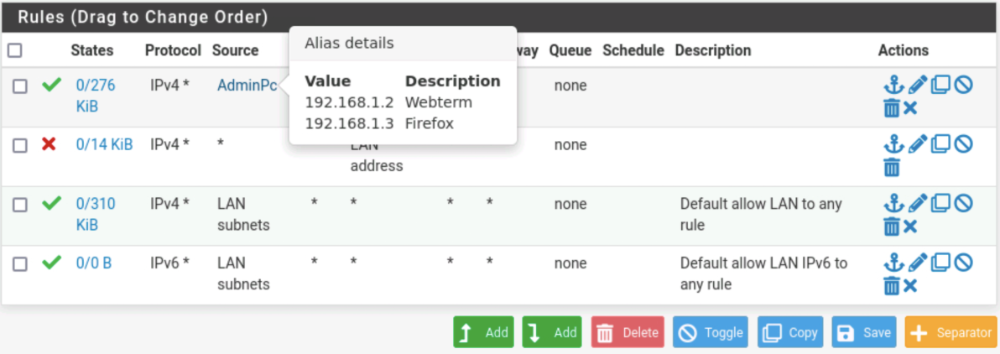
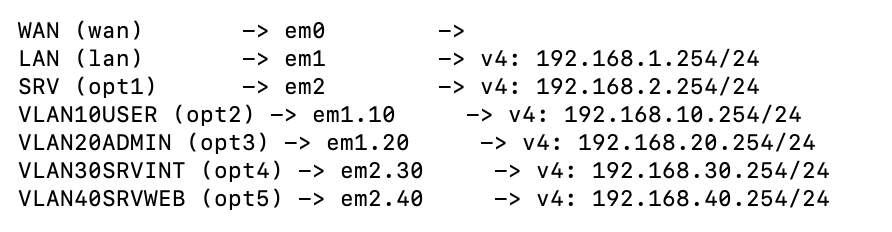
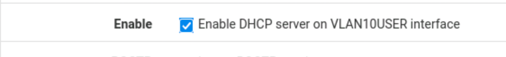
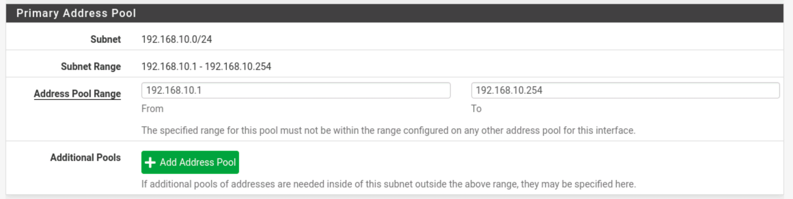
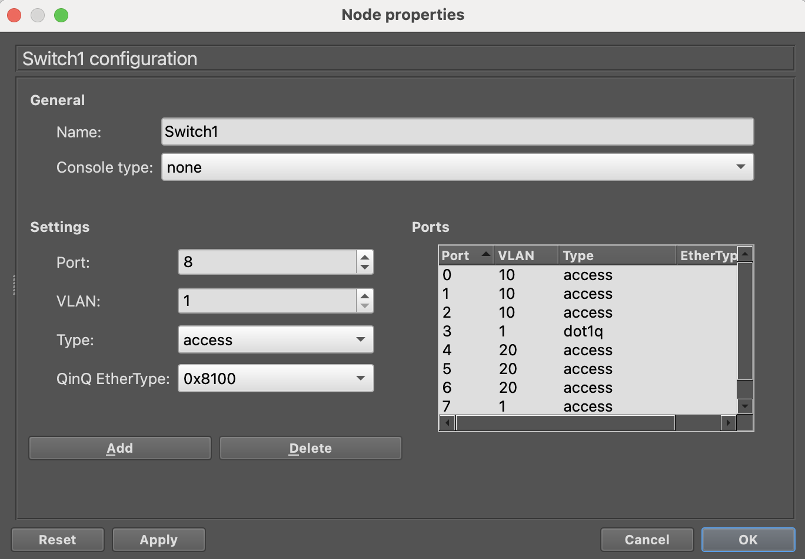
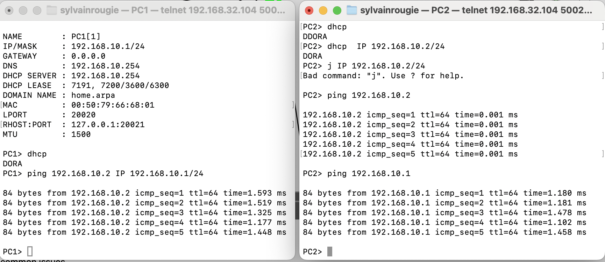
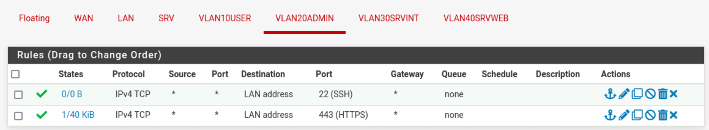

# Début du TP1 : 17/04/2025

Mise en place de GNS3 en client local sur macOS avec l’utilisation du serveur GNS3 du lab via WireGuard.

1. **Setup des VPC et réseau :**
   - Mise en place de 3 VPC avec un switch Ethernet.
   - Attribution des adresses IP et test de ping entre les différentes machines pour vérifier la connectivité.

---

# Début du TP2 : 17/04/2025

Lancement du TP2.

1. **Installation de pfSense sur GNS3 :**
   - J’ai fait le premier root avec l'installation de pfSense dans l’émulation de GNS3.
   - Installation de VNC Viewer pour avoir un accès graphique.
   - Configuration de pfSense avec le DHCP.
   - Vérification des IPs attribuées aux VPC et test de ping pour m'assurer que tout fonctionne.

---

**Question :** La passerelle est définie à 0.0.0.0. Quelles conséquences cela a-t-il sur la connectivité de cette machine ?

**Réponse :** La passerelle définie à 0.0.0.0 veut dire que les PC ne savent pas comment atteindre d’autres réseaux. Ils peuvent communiquer entre eux dans le même réseau, mais ils ne peuvent pas accéder à Internet ou à d’autres réseaux externes.

---

**Téléchargement et configuration des systèmes :**

1. **MicroCore Linux :**
   - J'ai tenté avec la version V4 clean, mais les commandes ne marchaient pas (beaucoup plus rapide à télécharger, 15 min pour le V6 avec la Wi-Fi).
   - J’ai donc pris la version V6, récupéré l’image, préparé le template et vérifié l’IP avec `ip a`. Tout est bien configuré depuis le serveur DHCP.

2. **WebTerms :**
   - Tentatives d'ajout de la configuration et de la bonne adresse IP.
   - Vérification de la connexion, tout est ok.
   - Tentative de connexion à pfSense, mais erreur. J’ai aussi tenté via VNC, mais ça a échoué. Le redémarrage de pfSense a été nécessaire, car j’avais mis la machine en pause pendant la pause déjeuner.

3. **Connexion réussie à pfSense via Firefox :**
   - Une fois l’IP bien configurée, la connexion à pfSense via Firefox s’est bien passée. Test de ping effectué et tout est ok.

4. **Setup de FirefoxGuest :**
   - Cette fois, c’était plus simple grâce au DHCP, connexion à pfSense directement avec l’IP vérifiée.

   

---

**Gestion de l’administration de pfSense :**

1. **Changement de mot de passe :**
   - J'ai changé le mot de passe par défaut sur pfSense.

2. **Lecture des règles de pare-feu :**


   **Question :** Sur quelle interface se fait l’administration du pare-feu ?
   **Réponse :** L’administration du pare-feu se fait via l’interface LAN, avec le port 80, comme on peut le voir dans les règles, où ce port est toujours accessible pour ne pas bloquer l’accès à l’interface admin.

   **Question :** Quelles remarques sur la sécurisation de l’accès à l’interface d’administration ?
   **Réponse :** La sécurité est assez faible car l'interface est en HTTP. Il serait préférable de limiter l’accès à des IPs spécifiques et d’ajouter une authentification multi-facteurs (MFA) pour renforcer la sécurité.

---

**Configuration des règles supplémentaires :**

1. **Mapping statique de FirefoxGuest :**
   - Je n’oublie pas de faire un mapping statique pour FirefoxGuest depuis le serveur DHCP.

2. **Application de la configuration :**
   - Ne pas oublier d'appliquer la configuration sinon ça sert a rien de faire plein de restart ça corrigera pas le probleme....

3. **Ajout des règles pour limiter l’accès à pfSense :**
   - J’ai bloqué l'accès à l’adresse LAN pour toutes les personnes qui ne sont pas dans l’alias par 192.168.1.2 et 192.168.1.3.
   
   - Ajout du TLS, puis une exception car le certificat n’était pas reconnu.


4. **Règles HTTPS pour plus de sécurité :**
   - J’ai configuré des règles pour ne permettre l’accès qu’en HTTPS, ce qui renforce la sécurité.

   **Question :** Pourquoi le navigateur signale-t-il un risque de sécurité ?
   **Réponse :** Le navigateur montre un risque car le certificat est auto-signé. Il n’est pas reconnu par les autorités de certification, d’où l’avertissement.

---

**Oublie de la configuration de l’IP :**
Ajout de l'ip administrateur 192.168.1.1 donc ajouter a l'alias.

**Objectifs de sécurité adressés :**

- **Sécurisation de l’accès à l’interface pfSense :** J’ai restreint l'accès à l’interface d’administration à seulement les IPs 192.168.1.2 et 192.168.1.3 pour limiter l’accès à des machines connues.
- **Passage de HTTP à HTTPS :** J’ai renforcé la sécurité en passant à HTTPS pour chiffrer les communications.
- **Gestion des certificats SSL :** J’ai ajouté une exception pour le certificat auto-signé pour éviter les erreurs de connexion tout en maintenant une sécurité acceptable.
- **Règles d'accès au pare-feu :** J’ai mis en place des règles pour limiter l’accès à pfSense uniquement aux IPs autorisées.


Voici la reprise de ton texte avec une mise en forme claire, incluant les tableaux et les étapes que tu as mentionnées :

---
# Début du TP3 : 18/04/2025

1. **Ajout de l'interface en mode IP statique** avec l'adresse 192.168.2.254/24.
2. **Vérification au niveau du DHCP** pour s'assurer qu'il est bien désactivé.


---

**Connexion SSH au pfSense**  
Ajout de la règle SSH dans le firewall pour autoriser les accès SSH depuis les PC admin.

---

**Création de la clé privée/public**  
Ajout de la clé publique sur l'interface web de pfSense pour le user `admin`. Ensuite, aller dans le système de configuration avancée et sélectionner l'utilisation obligatoire de la clé publique.


---

**Matrice de test**  
Voici la matrice de test de connectivité entre les différentes machines :

| To/From       | Firefox | Webterm | Admin | PC1  | PC2  | App Server | DB Server | LAN Address | SRV Address |
|---------------|---------|---------|-------|------|------|------------|-----------|-------------|-------------|
| **Firefox**   | -       | OK      | OK    | OK   | OK   | n.u.       | n.u.      | t.o.        | n.u.        |
| **Webterm**   | OK      | -       | OK    | OK   | OK   | t.o.       | t.o.      | t.o.        | t.o.        |
| **Admin**     | OK      | OK      | -     | OK   | OK   | n.u.       | n.u.      | t.o.        | n.u.        |
| **PC1**       | OK      | OK      | OK    | -    | OK   | n.u.       | n.u.      | t.o.        | n.u.        |
| **PC2**       | OK      | OK      | OK    | OK   | -    | n.u.       | n.u.      | t.o.        | n.u.        |
| **App Server**| n.u.    | n.u.    | n.u.  | n.u. | n.u. | -          | OK        | n.u.        | t.o.        |
| **DB Server** | n.u.    | n.u.    | n.u.  | n.u. | n.u. | OK         | -         | n.u.        | t.o.        |
| **FW**        | OK      | OK      | OK    | OK   | OK   | OK         | OK        | OK          | OK          |


Seul le webterm ici peut pinger le serveur de base de données et l'application, parce qu'il a une gateway de setup.
---

**Utilisation de tcpdump**

Voici les détails des captures réseau avec leurs interprétations et commentaires associés :

| Source             | Destination        | Traces em1 (o/n) | Traces em2 (o/n) | Interprétation et commentaires                                    |
|--------------------|--------------------|------------------|------------------|--------------------------------------------------------------------|
| **MicroCoreAdmin**  | **Webterm**         | n                | n                | Ping OK, aucun flux capturé car le trafic passe uniquement par le switch. |
| **MicroCoreAdmin**  | **fw LAN Address**  | o                | n                | Ping OK, flux aller/retour. `09:58:52.713773 IP 192.168.1.1 > 192.168.1.254: ICMP echo request` |
| **MicroCoreAdmin**  | **MicroCore-server**| n                | n                | Ping échoué : `ping: sendto: Network is unreachable`.               |
| **Webterm**         | **MicroCore-server**| n                | n                | Ping échoué mais flux capturé.               |
| **MicroCore-Server**| **fw SRV address**  | n                | o                | Timeout PING, mais ARP capturé. `10:07:12.783039 ARP, Request who-has 192.168.2.254` |
| **fw SRV address**  | **MicroCoreServer** | n                | o                | PING OK. Captures ARP et ICMP, flux aller/retour.                  |

---

**Résolution du problème de ping**  
Afin de résoudre le problème de l'absence de réponse au ping (capture sans réponse), on va autoriser les pings depuis n'importe où vers pfSense en ajoutant une règle dans le firewall.

L'ajout de la règle permet au protocole ICMP, peu importe sa provenance, de permettre le ping.


---

**Problème de la passerelle (gateway)**  
Lors du test de ping entre le LAN et le SRV, le ping ne peut pas s'effectuer car les machines n'ont pas de gateway sur laquelle aller pour apres chercher le bon réseau.


Pour les machines qui ne sont pas sous DHCP (comme celles du sous-réseau SRV), on doit ajouter la passerelle manuellement dans le fichier de démarrage :
```bash
sudo route add default gw 192.168.2.254
```

---

**Observation**  
On remarque que ce soit dans le sous reseau SRV ou dans le LAN, on a bien le ping qui passe entre les deux réseaux parce que l'on a bien mis la gateway et qu'il y a la règle dans le firewall pour autoriser le ping.


---

# Début du TP4 : 05/05/2025

Regle de pare-feu actuelle :

LAN:

SRV:


Matrice de flux:

| Source - Name | Source - IP     | Firewall Incoming Interface | Firewall Outgoing Interface | Destination - Name | Destination - IP | Protocol (L3-L4) | Port / Service (L5-L7) | Action |
| ------------- | --------------- | --------------------------- | --------------------------- | ------------------ | ---------------- | ---------------- | ---------------------- | ------ |
| All internal  | \*              | All internal interfaces     | any                         | \*                 | \*               | IMCP             |                        | Allow  |
| PCAdmin       | 192.168.1.1-3   | em1                         |                             | FW                 | 192.168.1.254    | TCP              | HTTPS / SSH            | Allow  |


## WireShark
Connexion a l'interface de pfSense via le webterm resultat dans le Wireshark:


### 🔹 1. **Décomposition OSI de la trame 1**

| Couche OSI                                              | Protocole/Donnée dans cette trame                                   |
| ------------------------------------------------------- | ------------------------------------------------------------------- |
| **Couche 2 - Liaison**                                  | **Ethernet II** : adresses MAC source/destination                   |
| **Couche 3 - Réseau**                                   | **IPv4** : IP source `192.168.1.2` → IP destination `192.168.1.254` |
| **Couche 4 - Transport**                                | **TCP** : port source `34826` → port destination `443`              |
| **Couche 5 à 7 - Session / Présentation / Application** | **TLSv1.2**          |


### 🔹 2. **Evidence du handshake TCP**

Dans cette capture Wireshark, le handshake TCP initial (SYN, SYN-ACK, ACK) n’apparaît pas dans les paquets visibles. L’échange commence à partir du paquet numéro 2, où le client (`192.168.1.2`) envoie déjà un paquet **ACK** au serveur (`192.168.1.254`) sur le port 443, ce qui indique que la connexion TCP a **déjà été établie**. Les paquets suivants montrent les échanges TLS, qui reposent sur cette connexion préexistante.

## Configuration des VLANs

Apres avoir configuré les VLANs sur pfSense,


Il faut modifier le VLAN user pour ajouter le DHCP.




La configuration au niveau du switch pour les vlans:


Test de ping entre PC1 et PC2:


Création du VLAN 20 admin et ajout des règles de firewall:
